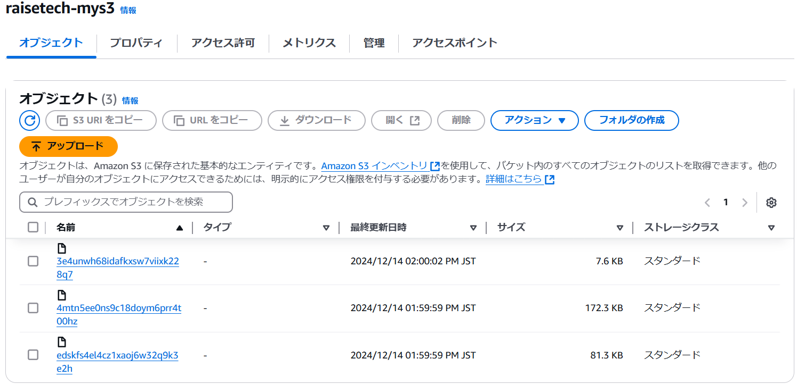

# 目次
1. 組み込みサーバーのみでの動作確認
1. 組み込みサーバーとUnixSocketを使った動作確認
1. Nginx単体動作確認
1. 組み込みサーバー、unix socket、nginxを使った動作確認
1. ALB追加したうえでの動作確認
1. S3を追加して動作確認
1. 構成図
1. 感想

# ①組み込みサーバーのみでの動作確認

- gitのインストール<br>`sudo yum install git`


- gitのバージョン確認<br>`git version`


- サンプルアプリケーションをクローン<br>`git clone https://github.com/yuta-ushijima/raisetech-live8-sample-app.git`   

- client_loopしないように設定<br><S-Del>`sudo vim /etc/ssh/sshd_config`

- 最終行に下記を追記する<br>`ClientAliveInterval 300`

- sshdの再読み込み<br>`sudo systemctl reload sshd.service`


## rubyインストール  
- railsの起動に必要なパッケージをインストール<br>`sudo yum install -y gcc-c++ glibc-headers openssl-devel readline libyaml-devel readline-devel zlib zlib-devel libffi-devel libxml2 libxslt libxml2-devel libxslt-devel sqlite-devel`

- rbenvのインストール<br>`git clone https://github.com/sstephenson/rbenv.git ~/.rbenv`  
上記でだけでは、コマンド実行できないのでPATHを設定
```
echo 'export PATH="$HOME/.rbenv/bin:$PATH"' >> ~/.bash_profile
echo 'eval "$(rbenv init -)"' >> ~/.bash_profile
source ~/.bash_profile
```

- ruby-buildのインストール<br>`git clone https://github.com/sstephenson/ruby-build.git ~/.rbenv/plugins/ruby-build`  
コマンドを使えるようにする  
`rbenv rehash`

- rubyインストール  
`rbenv install -v 3.2.3`  
- 使用するRubyのバージョンを指定    
`rbenv global 3.2.3`

## bundlerインストール  
`gem install bundler -v 2.3.14`

## nodeインストール  
- Node.jsが必要なのでnvmをインストール
```
git clone https://github.com/creationix/nvm.git ~/.nvm
source ~/.nvm/nvm.sh`
```

- 次回から起動時に読み込まれるように .bash_profile を編集  
`vi .bash_profile`  
以下を記述
```
if [ -f ~/.nvm/nvm.sh ]; then
      . ~/.nvm/nvm.sh
fi
```

- node インストール  
`nvm install v17.9.1`


## yarnインストール  
`npm install --global yarn`

yarnバージョン変更  
`yarn set version 1.22.19`


## MySQLインストール  
- 下記コマンドを実行してインスタンス作成初期からインストールされているMariaDB用パッケージを削除  
`sudo yum remove -y mariadb-*`

- 下記コマンドを実行してMySQLのリポジトリをyumに追加  
`sudo yum localinstall -y https://dev.mysql.com/get/「Red Hat Enterprise Linux 7 / Oracle Linux 7」の欄の下に記載されているリポジトリ名`

- 下記コマンドを実行してMySQLに必要なパッケージ(mysql-community-server)を取得  
`sudo yum install -y --enablerepo=mysql80-community mysql-community-server`

- 下記コマンドを実行してMySQLに必要なパッケージ(mysql-community-devel)を取得  
`sudo yum install -y --enablerepo=mysql80-community mysql-community-devel`

- 下記コマンドを実行してインストールされたMySQLに関係のあるパッケージを出力  
`yum list installed | grep mysql`

下記のように表示されたらOK
```
mysql-community-client.x86_64         8.0.28-1.el7                   @mysql80-community
mysql-community-client-plugins.x86_64 8.0.28-1.el7                   @mysql80-community
mysql-community-common.x86_64         8.0.28-1.el7                   @mysql80-community
mysql-community-devel.x86_64          8.0.28-1.el7                   @mysql80-community
mysql-community-icu-data-files.x86_64 8.0.28-1.el7                   @mysql80-community
mysql-community-libs.x86_64           8.0.28-1.el7                   @mysql80-community
mysql-community-server.x86_64         8.0.28-1.el7                   @mysql80-community
mysql80-community-release.noarch      el7-5                          installed
```
- 下記コマンドを実行してlogファイルを作成  
`sudo touch /var/log/mysqld.log`

- 下記コマンドを実行してmysqldを起動  
`sudo systemctl start mysqld`

- 下記コマンドを実行してmusqldの状態を確認  
`systemctl status mysqld.service`

- 下記コマンドを実行してmysqldがインスタンスの起動と同時に起動するように設定  
`sudo systemctl enable mysqld`  


- MySQLの設定  
config/database.ymlを作成  
`cp config/database.yml.sample config/database.yml`  
config/database.ymlを編集  
`vi config/database.yml`
```
username: "認証情報のユーザ名"
password: "認証情報のパスワード"
host: "RDSのエンドポイント"
```
を入力


## 環境構築  
`bin/setup`

## 組み込みサーバーの起動  
`bin/dev`

error Command failed with exit code 127.と表示されたため  
`yarn install`


## 動作確認  
`http://EC2のパブリック IPv4 アドレス:3000`  
動作しなかったら、EC2のインバウンド・アウトバウンド確認


## 画像を表示させる  
image magick インストール
```
sudo yum install ImageMagick
sudo yum install ImageMagick-devel
```
Gemfileにmini_magickを追加  
```
vi Gemfile
gem 'mini_magick'
bundle install
```
```
vi config/application.rb
config.active_storage.variant_processor = :mini_magick
```
```
rails active_storage:install
rails db:migrate
```

# ②組み込みサーバーとUnixSocketを使った動作確認
- config/puma.rbを開く  
`vim config/puma.rb`  
- port ENV.fetch("PORT") { 3000 }をコメントアウトする。行頭に#をつけるとコメントアウトできる  
`#port ENV.fetch("PORT") { 3000 }`


- railsを起動  
`rails s`


- 新しくターミナルを開いてsshで接続し動作確認をする(どっちでもいい)
```
curl --unix-socket /home/ec2-user/raisetech-live8-sample-app/tmp/sockets/puma.sock http://localhost/
curl --unix-socket /home/ec2-user/raisetech-live8-sample-app/tmp/sockets/puma.sock http://EC2のパブリック IPv4 アドレス/
```


# ③nginx単体の動作確認
- nginx インストール
`sudo amazon-linux-extras install nginx1`

- 初期設定ファイルのバックアップを取る
`sudo cp -a /etc/nginx/nginx.conf /etc/nginx/nginx.conf.backup`

- nginx 起動
`sudo systemctl start nginx`
- nginx起動確認
`systemctl status nginx`

- nginx動作確認
`http://EC2パブリック IPv4 アドレス`


# ④組み込みサーバー、unix socket、nginxを使った動作確認
- nginx起動停止
`sudo systemctl stop nginx`

- 新しく設定ファイル作成
`sudo vi /etc/nginx/conf.d/raisetech-live8-sample-app.conf`  
下記を記述
```
upstream puma {
  server unix:///home/ec2-user/raisetech-live8-sample-app/tmp/sockets/puma.sock;
}

server {
  listen 80;
  server_name [EC2パブリック IPv4 アドレス];

  root /home/ec2-user/raisetech-live8-sample-app/public;
  error_log  /var/log/nginx/error.log;
  access_log /var/log/nginx/access.log;
  client_max_body_size 2G;
  keepalive_timeout 5;

  #page cache loading
  try_files $uri/index.html $uri.html $uri @app;
  location / {

    # HTTP headers
    proxy_set_header X-Real-IP $remote_addr;
    index index.html index.htm;
    proxy_set_header X-Forwarded-Proto $scheme;
    proxy_set_header X-Forwarded-For $proxy_add_x_forwarded_for;
    proxy_set_header Host $http_host;
    proxy_redirect off;
    proxy_pass http://puma;

  }

}
```
- 権限付与 回帰オプション付けて
`chmod -R 701 /home/ec2-user`

- nginxのファイルにも権限を与える
```
chmod 701 /etc/nginx/nginx.conf
sudo chmod 701 /etc/nginx/conf.d/raisetech-live8-sample-app.conf
```
- nginx起動
`sudo systemctl start nginx`

- pumaをsystemctlで起動させる
```
sudo cp ~/raisetech-live8-sample-app/samples/puma.service.sample /etc/systemd/system/puma.service
sudo cat /etc/systemd/system/puma.service
sudo systemctl daemon-reload
```
- puma起動
`sudo systemctl start puma`
- pumaステータス確認
`sudo systemctl status puma`

- 動作確認
`http://EC2パブリックIPv4アドレス`


# ⑤ALB追加したうえでの動作確認
## ターゲットグループ作成
1. ターゲットタイプの選択
`インスタンス`
1. ターゲットグループ名　
`自分で決める、今回はraisetech-tg`
1. プロトコル : ポート　
`http：80`
1. IP アドレスタイプ　
`IPv4`
1. VPC　
`自分が作成したVPCを選択`
1. プロトコルバージョン　
`HTTP1`
1. ヘルスチェックプロトコル　
`HTTP`
1. ヘルスチェックパス　
`/`
1. ターゲットのEC2を選択して追加する

## ロードバランサー作成
1. ロードバランサータイプ　
`Application Load Balancerを選択`
1. ロードバランサー名　
`適当に今回はraisetech-alb`
1. スキーム
`インターネット向け`
1. ロードバランサーの IP アドレスタイプ　
`IPv4`
1. ロードバランサーの 
`IP アドレスタイプ`
1. VPC　
`自分が作成したVPCを選択`
1. マッピング・アベイラビリティーゾーン`public`を選択  
1. セキュリティグループ　
`作成したalb-securityを選択`
1. リスナーとルーティング
`http:80 作成したターゲットグループを選択`


## server_nameを変更する
```
sudo vi /etc/nginx/conf.d/raisetech-live8-sample-app.conf
server_nameをALBのDNS名に変更
```

`sudo nginx -t`すると
```
nginx: [emerg] could not build server_names_hash, you should increase server_names_hash_bucket_size: 64
nginx: configuration file /etc/nginx/nginx.conf test failed
```
と出る

解決するには
nginx.confを開く
`sudo vim /etc/nginx/nginx.conf`

server_names_hash_bucket_size 128;を入れる
```
http {
・・・
    keepalive_timeout  65;

この記述をこの下辺りに入れておけばOK
    server_names_hash_bucket_size 128;

・・・
}
```

`sudo nginx -t`すると
```
nginx: the configuration file /etc/nginx/nginx.conf syntax is ok
nginx: configuration file /etc/nginx/nginx.conf test is successful
```
になることを確認

`vi config/application.rb`を開き、一番下に
`config.hosts << "raisetech-alb-206070586.ap-northeast-1.elb.amazonaws.com"`を追記

`sudo vi /etc/nginx/conf.d/raisetech-live8-sample-app.conf`を開き  
server_nameを`raisetech-alb-206070586.ap-northeast-1.elb.amazonaws.com`に変更

## ALBのDNSをブラウザにコピペして動作確認


# ⑥S3を追加して動作確認
## S3作成  
バケットタイプ：汎用  
バケット名：raisetech-mys3  
他は何もいじらず作成

IAMロールを作成し、EC2にアタッチする  
s3Fullaccess

## ファイル設定変更
```
vi config/environments/development.rb
config.active_storage.service = :amazon
```
```
vi config/storage.yml
bucket: raisetech-mys3
```

- ALBのDNSをブラウザにコピペして動作確認  
- s3に画像が保存されているか確認




# 構成図


# 感想
- この課題ができるまで、紆余曲折の連続だった。ぶっちゃけすごくしんどかった。  
- 今回で学んだことは、まず見たことないコマンドやなんだこれ？と思ったことに対して、すぐ調べるという習慣をみいつけた法がいいと感じた。  
- 噂によれば、第１０回の課題が難しいらしいから少し不安。でも頑張る。
